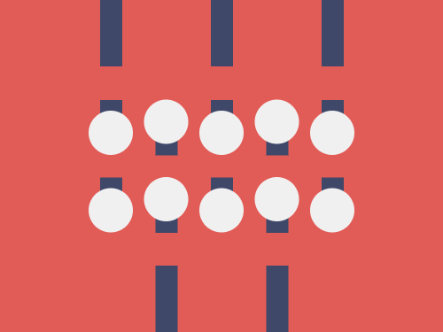
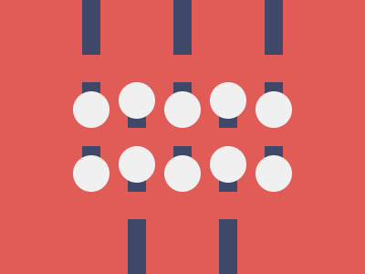

# #267. Knobs

Challenge: <https://cssbattle.dev/play/267>

## Result

<table>
	<tr>
		<th width="50%">User Submission</th>
		<th width="50%">Target</th>
	</tr>
	<tr>
		<td width="50%" align="center">
			
		</td>
		<td width="50%" align="center">
			
		</td>
	</tr>
</table>

## Code

```html
<p><p a><p b><style>*{background:#e25c57}p{height:60;width:20;margin:-8 82;color:#3f4869;box-shadow:25vw 0,50vw 0,50px 60vw,50vh 60vw;background:#3f4869;position:fixed}[a]{height:20;margin:82 82;box-shadow:25vw 0,50vw 0,0 70px,25vw 70px,50vw 70px,50px 30px,50vh 30px,50px 25vw,50vh 25vw}[b]{height:40;width:40;background:#f0f0f0;border-radius:1in;margin:92 72;color:#f0f0f0;box-shadow:25vw 0,50vw 0,0 70px,25vw 70px,50vw 70px,50px -10px,50vh -10px,50px 60px,50vh 60px
```
