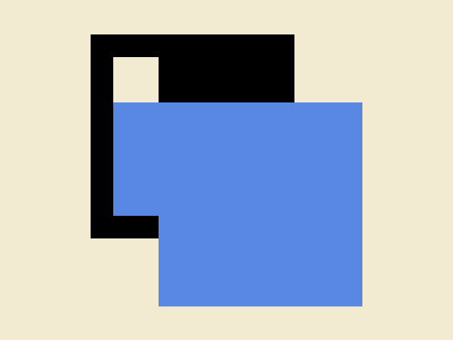

# #268. Square Shift

Challenge: <https://cssbattle.dev/play/268>

## Result

<table>
	<tr>
		<th width="50%">User Submission</th>
		<th width="50%">Target</th>
	</tr>
	<tr>
		<td width="50%" align="center">
			
		</td>
		<td width="50%" align="center">
			
		</td>
	</tr>
</table>

## Code

```html
<p a><p b><p b c><style>*{background:#F3EAD2}p{position:fixed;height:100;margin:22 72}[a]{width:40;border:solid#000;border-width:5vw 30vw 60px 5vw}[b]{background:#5887E4;width:220;margin:82 92}[c]{width:180;margin:162 132
```
