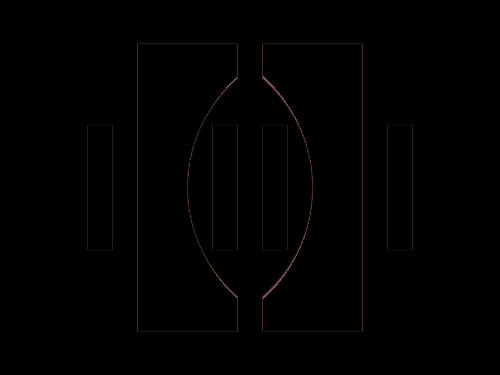

# #269. Parentheses

Challenge: <https://cssbattle.dev/play/269>

## Result

<table>
	<tr>
		<th width="50%">User Submission</th>
		<th width="50%">Target</th>
	</tr>
	<tr>
		<td width="50%" align="center">
			
		</td>
		<td width="50%" align="center">
			
		</td>
	</tr>
</table>

## Code

```html
<style>*{margin:0;background:repeating-linear-gradient(90deg,#394257 0 5vw,#0000 5vw 25vw,#394257 25vw 30vw,#0000 30vw 35vw)70px/65vw 25vw no-repeat,radial-gradient(1q at 200%50%,#0000 30vw,#EED9D9 0)110px 35px/5pc 230px no-repeat,radial-gradient(1q at -100%50%,#0000 30vw,#EED9D9 0)70vh 35px/5pc 230px no-repeat,#668884
```
