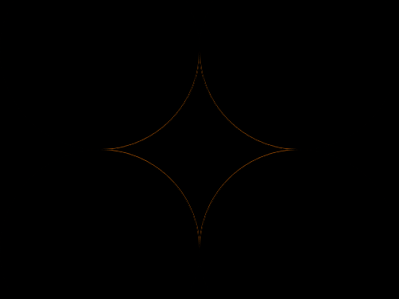

# #29. Suffocate

Challenge: <https://cssbattle.dev/play/29>

## Result

<table>
	<tr>
		<th width="50%">User Submission</th>
		<th width="50%">Target</th>
	</tr>
	<tr>
		<td width="50%" align="center">
			
		</td>
		<td width="50%" align="center">
			
		</td>
	</tr>
</table>

## Code

```html
<p><style>*{background:#F3AC3C}p{height:200;width:200;background:#F3AC3C;border-radius:50%;margin:-58 -8;box-shadow:50vw 0,0 50vw,50vw 50vw,25vw 25vw#1A4341;color:#F3AC3C
```
