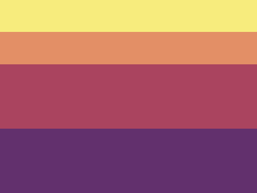
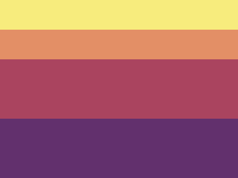

# #30. Horizon

Challenge: <https://cssbattle.dev/play/30>

## Result

<table>
	<tr>
		<th width="50%">User Submission</th>
		<th width="50%">Target</th>
	</tr>
	<tr>
		<td width="50%" align="center">
			
		</td>
		<td width="50%" align="center">
			
		</td>
	</tr>
</table>

## Code

```html
<body style=background:linear-gradient(#F7EC7D+0+50px,#E38F66+50px+25vw,#AA445F+25vw+50vw,#62306D+50vw+75vw>
```
