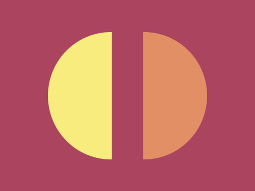
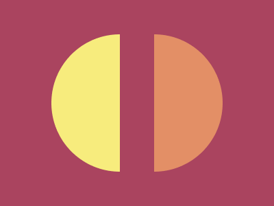

# #31. Equals

Challenge: <https://cssbattle.dev/play/31>

## Result

<table>
	<tr>
		<th width="50%">User Submission</th>
		<th width="50%">Target</th>
	</tr>
	<tr>
		<td width="50%" align="center">
			
		</td>
		<td width="50%" align="center">
			
		</td>
	</tr>
</table>

## Code

```html
<body bgcolor=#AA445F><p><p a><style>p{position:fixed;height:200;width:100;background:#F7EC7D;border-radius:25vw 0 0 25vw;top:34;left:75}[a]{left:225;transform:rotate(180deg);background:#E38F66
```
