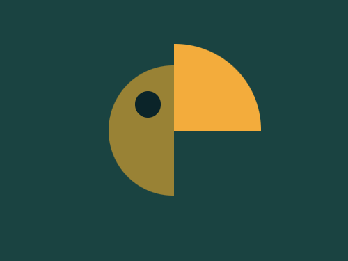
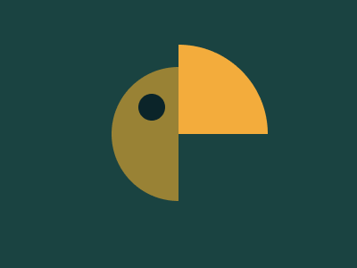

# #33. Birdie

Challenge: <https://cssbattle.dev/play/33>

## Result

<table>
	<tr>
		<th width="50%">User Submission</th>
		<th width="50%">Target</th>
	</tr>
	<tr>
		<td width="50%" align="center">
			
		</td>
		<td width="50%" align="center">
			
		</td>
	</tr>
</table>

## Code

```html
<body bgcolor=#1A4341><p><style>p{height:150;width:75;background:#998235;border-radius:75px 0 0 75px;margin:75 117} p:before{height:100;width:100;content:'';position:fixed;background:#F3AC3C;border-radius:0 25vw 0 0;left:200;top:50}p:after{height:30;width:30;content:'';position:fixed;background:#0B2429;border-radius:50%;top:105;left:155
```
