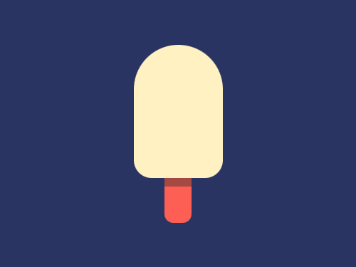

# #35. Ice Cream

Challenge: <https://cssbattle.dev/play/35>

## Result

<table>
	<tr>
		<th width="50%">User Submission</th>
		<th width="50%">Target</th>
	</tr>
	<tr>
		<td width="50%" align="center">
			
		</td>
		<td width="50%" align="center">
			
		</td>
	</tr>
</table>

## Code

```html
<body bgcolor=#293462><p><style>p{height:150;width:100;background:#FFF1C1;margin:50 142;border-radius:50px 50px 5vw 5vw}p:after{content:'';background:linear-gradient(#A64942 10px,#FE5F55 0);height:50;width:30;position:fixed;top:200;left:185;border-radius:0 0 10px 10px
```
