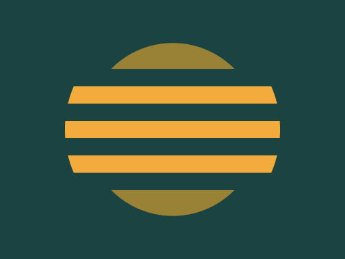
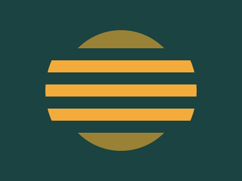

# #39. Sunset

Challenge: <https://cssbattle.dev/play/39>

## Result

<table>
	<tr>
		<th width="50%">User Submission</th>
		<th width="50%">Target</th>
	</tr>
	<tr>
		<td width="50%" align="center">
			
		</td>
		<td width="50%" align="center">
			
		</td>
	</tr>
</table>

## Code

```html
<p a r><p b><p c r><style>*{background:#1A4341}p{position:fixed;height:250;width:250;margin:17 67}[a]{scale:0.8;background:#998235}[b]{top:63;height:140;background:repeating-linear-gradient(#1A4341 0,#1A4341 5vw,#F3AC3C 5vw,#F3AC3C 5ch)}[r]{border-radius:3in}[c]{background:#0000;border:9vw solid#1A4341;margin:-19 31
```
