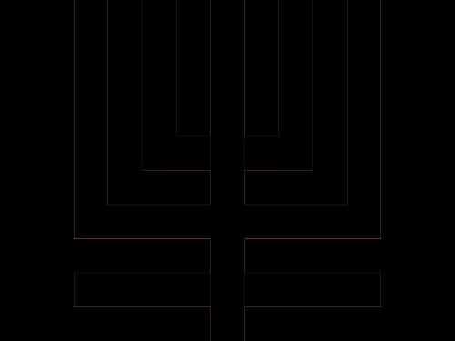
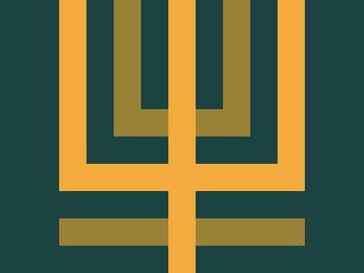

# #45. Magical Tree

Challenge: <https://cssbattle.dev/play/45>

## Result

<table>
	<tr>
		<th width="50%">User Submission</th>
		<th width="50%">Target</th>
	</tr>
	<tr>
		<td width="50%" align="center">
			
		</td>
		<td width="50%" align="center">
			
		</td>
	</tr>
</table>

## Code

```html
<body bgcolor=1A4341><p><p a><style>p{height:30;width:270;background:#F3AC3C;position:fixed;margin:172 57;box-shadow:0 60px,0-60px;color:#998235}[a]{height:208;width:30;top:-200;box-shadow:30px 0#1A4341,60px -30px#998235,30vw 0,70vh 0#1A4341,60vw 0,30vw+5cm,45vw -30px#998235;color:#F3AC3C
```
