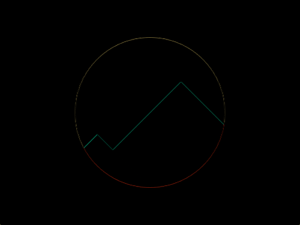

# #46. Mountains

Challenge: <https://cssbattle.dev/play/46>

## Result

<table>
	<tr>
		<th width="50%">User Submission</th>
		<th width="50%">Target</th>
	</tr>
	<tr>
		<td width="50%" align="center">
			
		</td>
		<td width="50%" align="center">
			
		</td>
	</tr>
</table>

## Code

```html
<p><p a><p b><style>&{background:#FFF1C1}p{width:200;height:200;background:#FE5F55;position:fixed;rotate:45deg;margin:142 133}[a]{margin:213 22}[b]{border-radius:3in;margin:-108-58;background:transparent;border:50vh solid#293462
```
