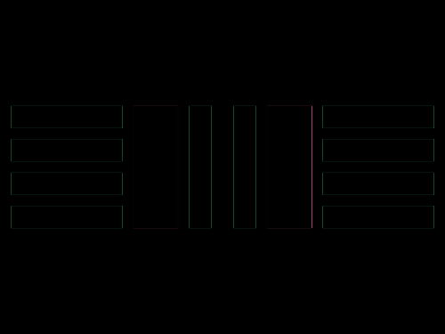

# Daily Target — Jun 11, 2026

Challenge: <https://cssbattle.dev/play/dzlLXaBViRAZUK7t6jye>

## Result

<table>
	<tr>
		<th width="50%">User Submission</th>
		<th width="50%">Target</th>
	</tr>
	<tr>
		<td width="50%" align="center">
			
		</td>
		<td width="50%" align="center">
			
		</td>
	</tr>
</table>

## Code

```html
<style>&{background:repeating-linear-gradient(#333 0 20px,#0000 0 30px)10px 95px/380px 120px no-repeat#55C085;*{background:linear-gradient(90deg,#55C085 10px,#333 0 30px,#55C085 0 50px,#333 0 70px,#55C085 0)40px/80px no-repeat#FFF;margin:95 110;border-inline:10px solid#55C085
```
