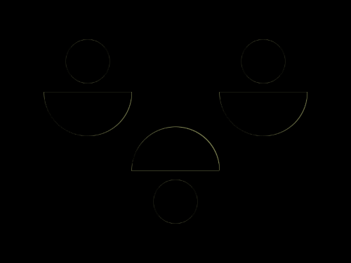

# Daily Target — Jun 13, 2026

Challenge: <https://cssbattle.dev/play/bntxlo7Wue1WgUtO6vJB>

## Result

<table>
	<tr>
		<th width="50%">User Submission</th>
		<th width="50%">Target</th>
	</tr>
	<tr>
		<td width="50%" align="center">
			
		</td>
		<td width="50%" align="center">
			
		</td>
	</tr>
</table>

## Code

```html
<p><p a><p b><p c><p c d><p c e><style>*{background:#EFEADE}p{background:#594F7C;position:fixed;height:50;width:50;border-radius:9in;margin:37 67}[a]{left:208}[b]{margin:197 167}[c]{width:100;border-radius:0 0 1in 1in;margin:97 42}[d]{left:208}[e]{rotate:180deg;margin:137 142
```
