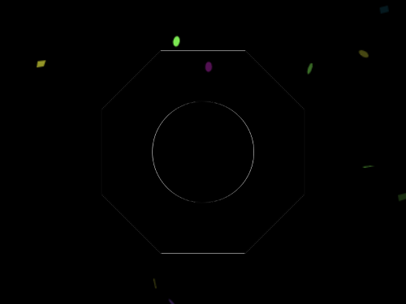
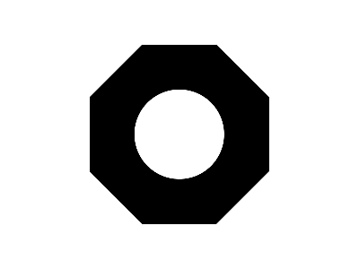

# Daily Target — Jun 14, 2026

Challenge: <https://cssbattle.dev/play/QOStkHKvkB7UHWpkZD72>

## Result

<table>
	<tr>
		<th width="50%">User Submission</th>
		<th width="50%">Target</th>
	</tr>
	<tr>
		<td width="50%" align="center">
			
		</td>
		<td width="50%" align="center">
			
		</td>
	</tr>
</table>

## Code

```html
<div id="o"><p><style>#o{width:200;background:#000;margin:42 92;aspect-ratio:1;--o:calc(50%*tan(-22.5deg));clip-path: polygon(var(--o)50%,50%var(--o),calc(100% - var(--o))50%,50%calc(100% - var(--o)));position:fixed;}p{height:100;width:100;background:#FFF;border-radius:3in;margin:50
```
