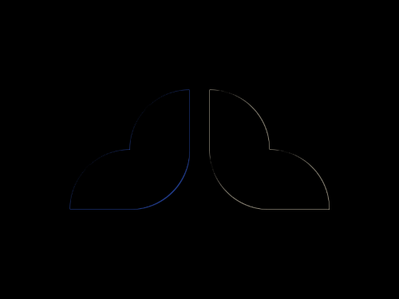

# Daily Target — Jul 1, 2026

Challenge: <https://cssbattle.dev/play/yvpHijyS5DDPWOUnCQm8>

## Result

<table>
	<tr>
		<th width="50%">User Submission</th>
		<th width="50%">Target</th>
	</tr>
	<tr>
		<td width="50%" align="center">
			
		</td>
		<td width="50%" align="center">
			
		</td>
	</tr>
</table>

## Code

```html
<p><p a><style>p,p:before,p:after{background:#D9BB61;height:60;width:60;margin:142 62;border-radius:1in 0 0;content:'';display: block;position:fixed}p:before{margin:-60 60}p:after{rotate:180deg;margin:0 60}[a]{rotate:90deg;margin:82 202}[a],[a]:before,[a]:after{background:#394257
```
