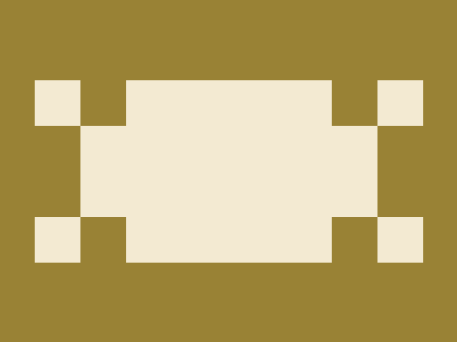

# Daily Target — Jul 6, 2026

Challenge: <https://cssbattle.dev/play/31jQ9hSUF6QsJx0qO66P>

## Result

<table>
	<tr>
		<th width="50%">User Submission</th>
		<th width="50%">Target</th>
	</tr>
	<tr>
		<td width="50%" align="center">
			
		</td>
		<td width="50%" align="center">
			
		</td>
	</tr>
</table>

## Code

```html
<p><p a><style>*{background:#998235}p{width:340;background:#F3EAD2;height:160;margin:62 22;position:fixed}[a]{height:40;width:40;color:#998235;box-shadow:10vw 0,260px   0,0 40px,0 80px,40px 120px,300px 40px,300px 80px,260px 30vw
```
