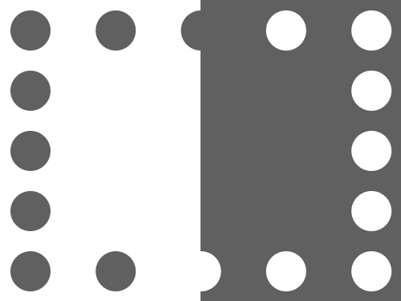
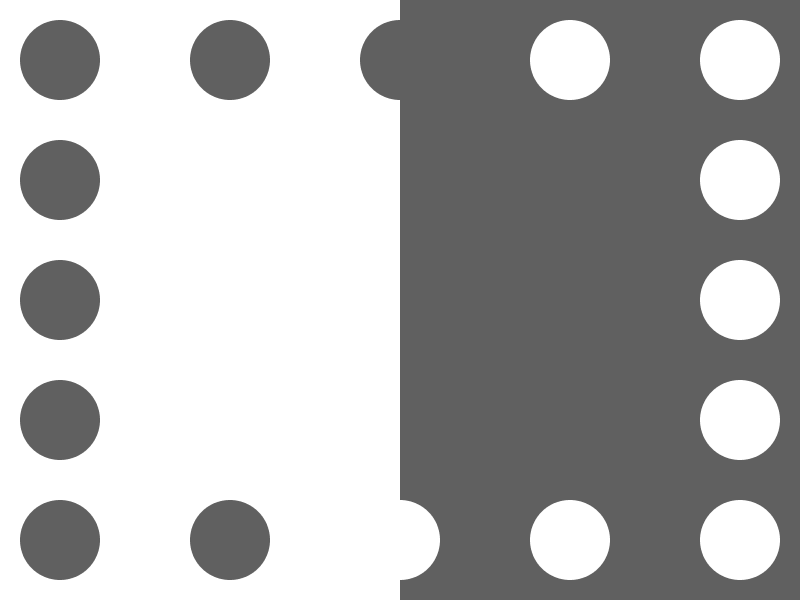

# Target 247: LEDs

Challenge: <https://cssbattle.dev/play/247>

## Result

<table>
	<tr>
		<th width="50%">User Submission</th>
		<th width="50%">Target</th>
	</tr>
	<tr>
		<td width="50%" align="center">
			
		</td>
		<td width="50%" align="center">
			
		</td>
	</tr>
</table>

## Code

```html
<p><p a><style>p{height:300;width:200;background:#606060;position:fixed;top:-16;left:200}[a]{height:40;width:40;margin:26 -190;border-radius:50%;box-shadow:90q 0#606060,180q 0#606060,85vh 0#FFF,9cm 0#FFF,0 15vw#606060,0 30vw#606060,0 45vw#606060,0 60vw#606060,90q 60vw#606060,180q 60vw#FFF,85vh 60vw#FFF,9cm 60vw#FFF,9cm 15vw#FFF,9cm 30vw#FFF,9cm 45vw#FFF
```

## Submission Data

- Challenge: Target 247: LEDs
- Score: 613.57
- Match: 100%
- Submitted at: 2026-06-10T07:38:32.397Z
