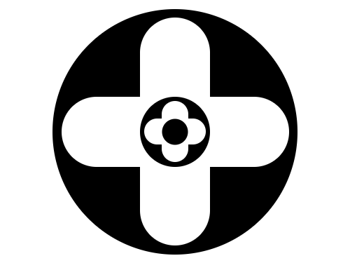
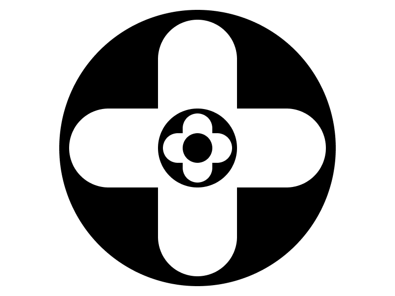

# Target 250: Recursion

Challenge: <https://cssbattle.dev/play/250>

## Result

<table>
	<tr>
		<th width="50%">User Submission</th>
		<th width="50%">Target</th>
	</tr>
	<tr>
		<td width="50%" align="center">
			
		</td>
		<td width="50%" align="center">
			
		</td>
	</tr>
</table>

## Code

```html
<p><p a><p a b><p c><p e a><p f a b><p g c><style>p{height:280;width:280;background:#000;position:fixed;margin:2 52;border-radius:6in}[a]{background:#FFF;height:80;width:260;top:108;left:18}[b]{height:260;width:80;top:18;left:108}[c]{height:80;width:80;top:108;left:108}[e]{height:30;width:70;top:133;left:113}[f]{height:70;width:30;top:113;left:133}[g]{transform:scale(0.37
```

## Submission Data

- Challenge: Target 250: Recursion
- Score: 611.32
- Match: 100%
- Submitted at: 2026-06-09T13:44:35.983Z
