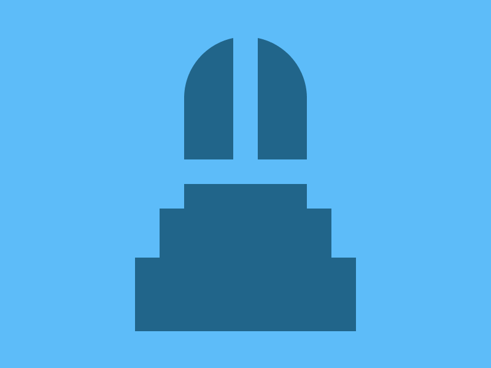

# Target 251: The Door

Challenge: <https://cssbattle.dev/play/251>

## Result

<table>
	<tr>
		<th width="50%">User Submission</th>
		<th width="50%">Target</th>
	</tr>
	<tr>
		<td width="50%" align="center">
			
		</td>
		<td width="50%" align="center">
			
		</td>
	</tr>
</table>

## Code

```html
<p a i><p b><p i c d><p d e><style>*{background:#5DBCF9;position:fixed;height:20;width:100}[i]{background:#21658A}[a]{margin:142 142;box-shadow:0 5ch 0 5vw#21658A,0 25vw 0 5ch#21658A}[b]{scale:2;margin:272 135}[c]{border-radius:1in 1in 0 0;margin:22 142}[d]{height:100}[e]{width:20;margin:22 182
```

## Submission Data

- Challenge: Target 251: The Door
- Score: 624.04
- Match: 100%
- Submitted at: 2026-06-08T14:57:47.365Z
