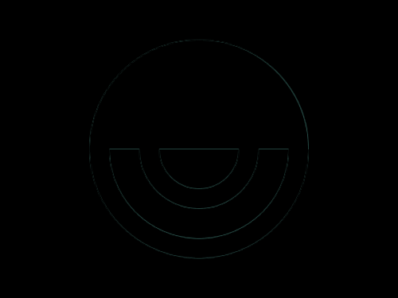

# Target 252: Pendant

Challenge: <https://cssbattle.dev/play/252>

## Result

<table>
	<tr>
		<th width="50%">User Submission</th>
		<th width="50%">Target</th>
	</tr>
	<tr>
		<td width="50%" align="center">
			
		</td>
		<td width="50%" align="center">
			
		</td>
	</tr>
</table>

## Code

```html
<p b><p a><style>*{background:#6BCF87}[b]{height:80;width:80;margin:102 152;box-shadow:0 0 0 5vw#294C0E,0 0 0 53q#6BCF87,0 0 0 74q#294C0E}p{border-radius:9in;position:fixed}[a]{height:110;width:220;background:#294C0E;border-radius:3in 3in 0 0;margin:32 82
```

## Submission Data

- Challenge: Target 252: Pendant
- Score: 635.2
- Match: 100%
- Submitted at: 2026-06-08T16:52:47.182Z
