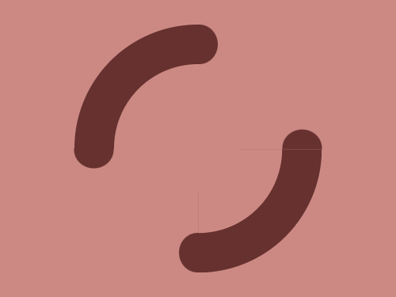
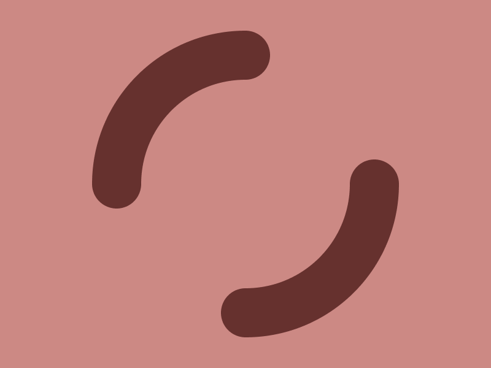

# Target 253: Microbes

Challenge: <https://cssbattle.dev/play/253>

## Result

<table>
	<tr>
		<th width="50%">User Submission</th>
		<th width="50%">Target</th>
	</tr>
	<tr>
		<td width="50%" align="center">
			
		</td>
		<td width="50%" align="center">
			
		</td>
	</tr>
</table>

## Code

```html
<p a><p a b><p c><p c d><p c e><p c f><style>*{background:#CC8984;}p{margin:17 67;position:fixed}[a]{height:85;width:85;border-radius:3in 0 0;border:5ch solid#66312E;border-bottom:0;border-right:0;}[b]{rotate:180deg;margin:142 192}[c]{height:40;width:20;background:#66312E;border-radius:0 1in 1in 0;margin:17 192}[d]{rotate:90deg;margin:132 77}[e]{rotate:180deg;margin:227 173}[f]{rotate:-90deg;margin:113  287
```

## Submission Data

- Challenge: Target 253: Microbes
- Score: 608.03
- Match: 100%
- Submitted at: 2026-06-07T16:50:34.816Z
